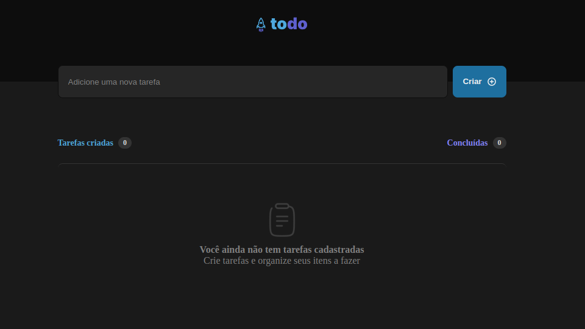
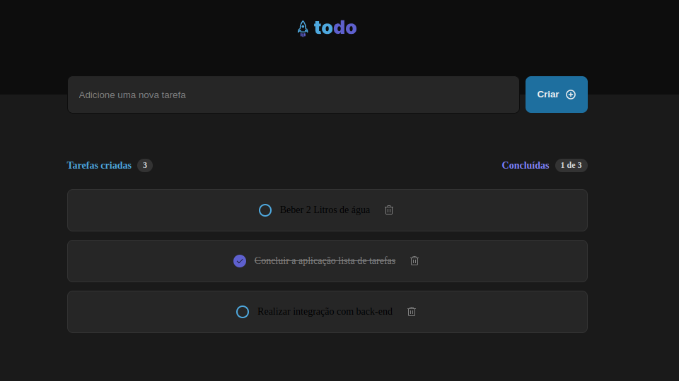

# ToDO - List
### React + TypeScript + Vite

Aplicação para controle de tarfas. Possui as seguintes funcionalidades:

- Adicionar uma nova tarefe
- Marcar e desmarcar uma tarefa como concluída
- Remover uma tarefa da listagem
- Mostrar o progresso de conclusão das tarefas

  

